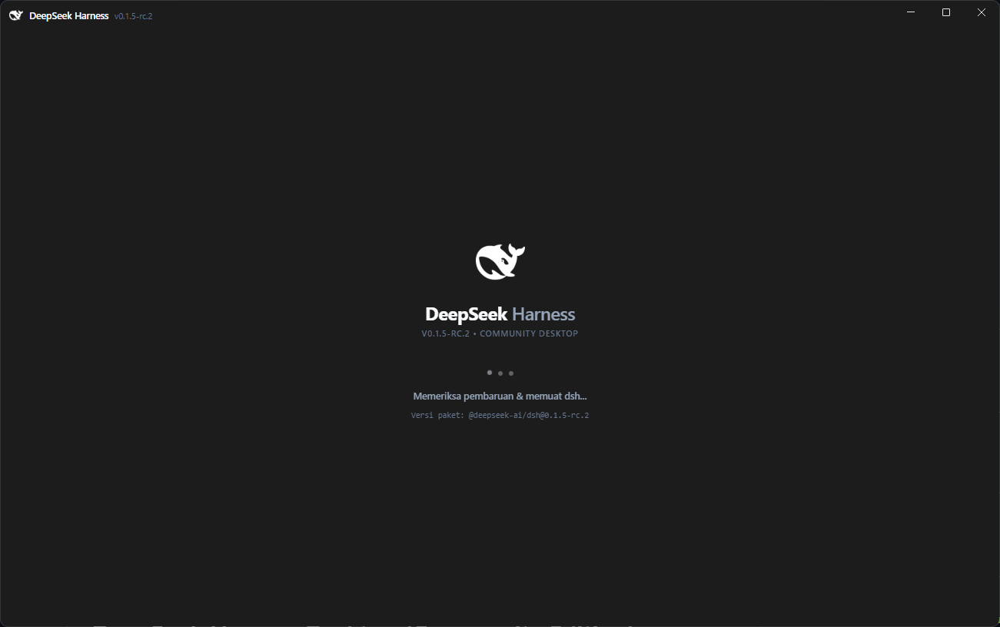
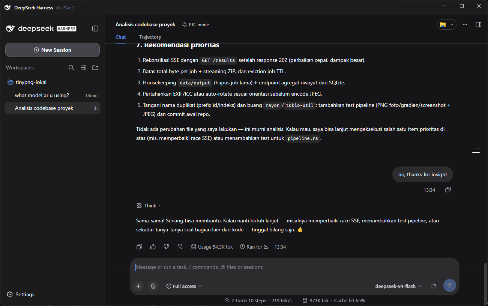

# DeepSeek Harness Desktop (Community Edition)

> **Disclaimer**: This is an unofficial, community-driven open-source project and is not affiliated with, maintained, or endorsed by DeepSeek. It is built for developers and enthusiasts who want a desktop app experience for the DeepSeek Harness.

## Screenshots



*Splash screen:* custom title bar with backend version, DeepSeek Harness logo, animated loader, and live status (checking for updates / starting `dsh web`).



*Main window:* the running `dsh web` UI inside the desktop shell — native-like title bar, workspace sidebar, chat / trajectory view, and task input box.

## How it works

This app is a thin Electron shell around the official backend package. On every launch it runs:

```text
npx @deepseek-ai/dsh web --no-open
```

and displays the printed URL (including its one-time `?token=` session token) inside a native-like window. Consequences worth knowing:

- **Backend updates itself.** Because the `npx` spec has no version pin, every online launch resolves to the newest stable release. No rebuild needed for backend updates.
- **The shell does not.** `main.js`, the splash screen, and the title bar are frozen at build time. A breaking backend change may require a new app release.
- **One shared data home.** The desktop app and a manually installed `dsh` CLI use the same package (`@deepseek-ai/dsh`) and the same data directory (`~/.dsh`: profiles, sessions, settings). Sessions created in one are visible in the other. Do not run both on the default port at the same time (see Troubleshooting).
- **The `.exe` is not fully standalone.** It bundles the Electron runtime, but the backend still needs a system-wide Node.js/`npx` to download and run.

## Requirements

- **Node.js 20 or newer** (includes `npm` and `npx`) — mandatory on every machine that runs the app, **including from a prebuilt `.exe`**. Verify with `node -v` and `npx -v`.
- **Internet connection** — required on the first run to download the backend, and afterwards to receive backend updates. Once cached, the app also starts offline using the last downloaded copy.
- **Disk space** — roughly 500 MB total for dependencies, the Electron runtime, and the backend cache.

## Install and run

### Windows

1. Install **Node.js 20+** from [nodejs.org](https://nodejs.org/).
2. Download `DeepSeek Harness Setup 1.0.0.exe` (installer) or `DeepSeek Harness 1.0.0.exe` (portable, just double-click) from the [GitHub Releases](https://github.com/danyakmallun9999/dsh-desktop/releases) page.
3. Stay online on the first launch. Downloading and starting the backend can take up to a minute; the splash screen shows live progress.
4. Notes:
   - The builds are **unsigned**, so Windows SmartScreen will warn. Choose *More info → Run anyway*.
   - Only the Electron shell is bundled — Node.js must be installed separately.

### Linux

1. Install **Node.js 20+** first (`node -v`).
2. Clone and run the setup script (installs dependencies, registers desktop shortcuts and the application menu entry):

```bash
git clone https://github.com/danyakmallun9999/dsh-desktop.git
cd dsh-desktop
./install.sh
```

Prebuilt `.AppImage`/`.deb` packages will be published via GitHub Releases once the Linux CI job is enabled.

### macOS

Install **Node.js 20+**, then download the `.dmg` from [GitHub Releases](https://github.com/danyakmallun9999/dsh-desktop/releases) (available once the macOS CI job is enabled), open it, and drag `DeepSeek Harness` into `Applications`.

## Run from source (developers)

```bash
git clone https://github.com/danyakmallun9999/dsh-desktop.git
cd dsh-desktop
npm install
npm start
```

Or via the bundled CLI launcher:

```bash
npx .
```

## Build locally

```bash
npm run dist        # package for the current OS
npm run dist:win    # Windows: NSIS installer + portable .exe (verified)
npm run dist:linux  # Linux: .AppImage + .deb
npm run dist:mac    # macOS: .dmg + .zip
```

Output goes to `dist/`. (`electron` lives in `devDependencies`, as required by `electron-builder`.)

Releases are produced by CI: pushing a tag like `v1.0.1` builds the Windows `.exe` files and attaches them to a GitHub Release automatically. Linux and macOS jobs exist in the workflow file and can be enabled by uncommenting them.

## Features

- **Seamless native title bar.** The window uses a Window Controls Overlay tinted to match the app, with the native minimize/maximize/close buttons. The bar is rendered by the app itself (logo, name, backend version, full drag region), while the DeepSeek UI starts below it — so the buttons can never cover content.
- **Token-aware backend attach.** The launcher captures the full `?token=` session URL printed by `dsh web` and refuses to load bare URLs that would only answer `401 authentication required`.
- **Automatic backend updates.** Detected via npm output and shown as a pill on the splash screen.
- **System tray.** Server status, backend version, open in external browser, copy local URL, reload, backend restart, quit.
- **Honest version display.** The version shown on the splash screen, title bar, and tray is measured from the actually running backend (`npx … --version`), falling back to the npm registry tag. It is never hardcoded.
- **Window state memory.** Size, position, and maximized state persist between launches.
- **Diagnostics log.** The launcher writes `launcher.log` next to the window state file (see Troubleshooting) because packaged apps have no visible console.
- **Clean shutdown.** The backend child process is terminated on quit (synchronously on Windows, so no port-holding zombies).

## Keyboard shortcuts

| Shortcut | Action |
| --- | --- |
| `Ctrl + R` / `F5` | Reload |
| `F11` | Toggle fullscreen |
| `Ctrl + Shift + I` / `F12` | Toggle developer tools |

## Troubleshooting

**Stuck on the splash screen.**
Open the launcher log and read the last lines:
- Windows: `%APPDATA%\dsh-desktop\launcher.log`
- Linux/macOS: `~/.config/dsh-desktop/launcher.log`

Common causes: Node.js/`npx` missing from `PATH` (the app shows an error dialog for this), no internet on first run, or a stale backend holding the port (see below).

**`EADDRINUSE` / backend exits immediately.**
Another `dsh web` already holds the port — often a leftover process from a previous run, or your manually installed CLI running on the default port 3080. Stop the other process, or run the manual one on a different port (`dsh web --port 8080`).

**A foreign page opens instead of DeepSeek.**
The startup port scan checks `3080, 8080, 3000, 3001, 8081, 5000, 5173`. If you run an unrelated dev server on one of those ports, the app may attach to it. Free the port or stop that server before launching.

**SmartScreen / Gatekeeper warnings.**
Expected: releases are unsigned. Windows: *More info → Run anyway*.

**Offline start.**
Works if the backend was downloaded before (cached copy is used). The version indicator stays in its pending state until a version is known.

## Updating

- **Backend:** automatic on every online launch (no action needed).
- **App shell:** download the newer release and install over the old one. To follow prerelease backend channels instead of stable, change the single `DSH_SPEC` constant in `main.js`.

## Project structure

```text
main.js          # all launcher logic: window, backend spawn, tray, updates
preload.js       # minimal IPC bridge (status updates only)
loading.html     # splash screen (dynamic version, dot loader, log ticker)
titlebar.html    # custom title bar view (drag region, app name, version)
bin/cli.js       # `npx .` launcher
install.sh       # Linux desktop integration
run.sh           # Linux dev-run helper (loads nvm paths)
```

## License

This project is licensed under the [MIT License](LICENSE).
